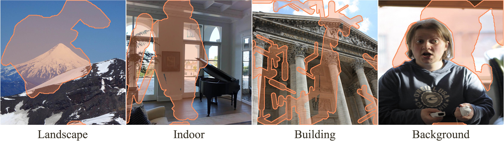

<p align="center">
  <h1 align="center">Towards Enhanced Image Inpainting:<br>
Mitigating Unwanted Object Insertion and Preserving Color Consistency</h1>
<center>Yikai Wang*, Chenjie Cao*, Junqiu Yu*, Ke Fan, Xiangyang Xue, Yanwei Fu†.<br>
Fudan University<br>
<b>CVPR 2025 <font color="#ed7748">(Highlight)</font></b>
</center>
  <p align="center">
    <a href="https://arxiv.org/abs/2312.04831"></a>
    <a href="https://yikai-wang.github.io/asuka/"></a>

  </p>
  <br>
</p>

## Overview
This repo contains the proposed ASUKA algorithm and the evaluation dataset MISATO in our paper "[Towards Enhanced Image Inpainting: Mitigating Unwanted Object Insertion and Preserving Color Consistency](https://arxiv.org/abs/2312.04831)".

> ASUKA solves two issues existed in current diffusion and rectified flow inpainting models:
<b>Unwanted object insertion</b>, where randomly elements that are not aligned with the unmasked region are generated;
<b>Color-inconsistenc</b>y, the color shift of the generated masked region, causing smear-like traces.
ASUKA proposes a post-training procedure for these models, significantly mitigates object hallucination and improves color consistency of inpainted results.

> While unwanted object insertion is a specific problem in general image inpainting, <b>color inconsistency affects all text-to-image editing models</b>. Our proposed decoder can consistently improve performance by addressing this issue.

We released ASUKA for [FLUX.1-Fill-dev](https://huggingface.co/black-forest-labs/FLUX.1-Fill-dev), denoted as ASUKA(FLUX.1-Fill).
We also release the MISATO dataset at resolutions 512 and 1024.
We are actively working to improve both our model and evaluation dataset.
If you encounter failure cases with ASUKA (FLUX.1-Fill) or have challenging examples in image inpainting, we would love to hear from you. Please email them to yi-kai.wang@outlook.com.
We truly appreciate your contributions!

## Disclaimer
This repo, the ASUKA algorithm, and the MISATO dataset is intended to use for reserach purpose only, and we respect all the license of used models and codes. Users are granted the freedom to create images using this tool, but they are expected to comply with local laws and utilize it in a responsible manner. The developers do not assume any responsibility for potential misuse by users.

The authors do not own the image copyrights. Please follow the original dataset's license. We appreciate the contributions of  [Matterport3D](https://github.com/niessner/Matterport), [FlickrLandscape](https://github.com/mahmoudnafifi/HistoGAN?tab=readme-ov-file), [MegaDepth](https://www.cs.cornell.edu/projects/megadepth/), and [COCO 2014](https://cocodataset.org).

**To use Matterport3D, you must indicate that you agree to the terms of use by signing the Terms of Use agreement form, using your institutional email addresses, and sending it to: matterport3d@googlegroups.com.**


## Updates

 - [x] Released the ASUKA (FLUX.1-Fill) model and inference code.
 - [x] Released the MISATO@1K dataset.
 - [x] Released the MISATO@512 dataset.

## ASUKA model

We've released a version of the ASUKA model compatible with the [FLUX.1-Fill-dev](https://huggingface.co/black-forest-labs/FLUX.1-Fill-dev) inpainting model.
Please refer to the sub-folder for more information.

## MISATO dataset



> To validate the inpainting performance across different domains and mask styles, we construct a evaluation dataset, dubbed as MISATO, from [Matterport3D](https://github.com/niessner/Matterport), [FlickrLandscape](https://github.com/hubert0527/infinityGAN?tab=readme-ov-file#b-prepare-data), [MegaDepth](https://www.cs.cornell.edu/projects/megadepth/), and [COCO 2014](https://cocodataset.org) for indoor, outdoor landscape, building, and background inpainting.

### Download

The MISATO Dataset is available at [Huggingface](https://huggingface.co/datasets/yikaiwang/MISATO).

### Structure

After unzipping the file, you will find two folders: one for 512 resolution and one for 1024. Each folder has the following structure:

```
|-image
  |- 0000.png
  ...
  |- 1999.png
|-mask
  |- 0000.png
  ...
  |- 1999.png
```
The numbers 0000-0499 represent outdoor landscapes, 0500-0999 represent indoor scenes, 1000-1499 represent buildings, and 1500-1999 represent backgrounds.
The MISATO@1K version includes only 1500 image-mask pairs, as the COCO dataset lacks enough high-resolution images.


## License
Code related to the ASUKA algorithm is under Apache 2.0 license.


## BibTeX
If you find our repo helpful, please consider cite our paper :)
```bibtex
@inproceedings{wang2025towards,
  title={Towards Enhanced Image Inpainting: Mitigating Unwanted Object Insertion and Preserving Color Consistency.},
  author={Wang, Yikai and Cao, Chenjie and Yu, Junqiu and Fan, Ke and Xue, Xiangyang and Fu, Yanwei},
  booktitle={Proceedings of the IEEE/CVF conference on computer vision and pattern recognition},
  year={2025}
}
```

