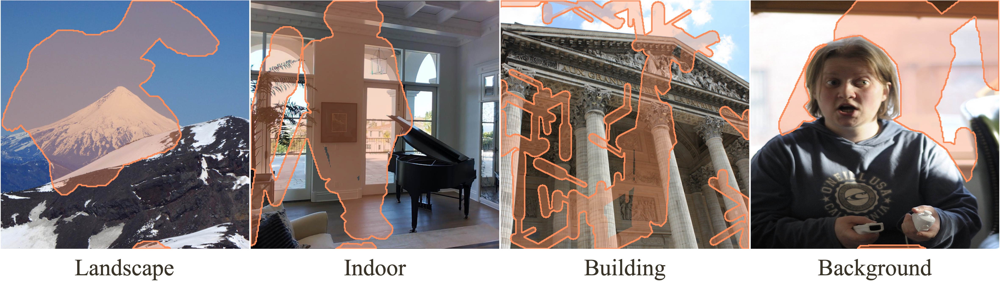

# MISATO dataset

\[[preprint](https://arxiv.org/abs/2312.04831)\]\[[intro](https://yikai-wang.github.io/asuka/)\]\[demo:[Youtube](https://www.youtube.com/shorts/q8WwvEtqiJ4),[Bilibili](https://b23.tv/wp2qCk6)\]



## Overview
This repo contains the proposed evaluation dataset MISATO in our paper "[Towards Stable and Faithful Inpainting](https://arxiv.org/abs/2312.04831)" .

> Our proposed Aligned Stable Inpainting with UnKnown Areas Prior (ASUKA) employs a reconstruction-based masked auto-encoder as a stable prior. Aligned with the stable diffusion inpainting model, ASUKA significantly improves inpainting stability. ASUKA further aligns masked and unmasked regions through an inpainting-specialized decoder, ensuring more faithful inpainting.

> To validate the inpainting performance across different domains and mask styles, we construct a evaluation dataset, dubbed as MISATO, from [Matterport3D](https://github.com/niessner/Matterport), [FlickrLandscape](https://github.com/hubert0527/infinityGAN?tab=readme-ov-file#b-prepare-data), [MegaDepth](https://www.cs.cornell.edu/projects/megadepth/), and [COCO 2014](https://cocodataset.org)for indoor, outdoor landscape, building, and background inpainting.

## Disclaimer

The authors do not own the image copyrights. Please follow the original dataset's license. We appreciate the contributions of  [Matterport3D](https://github.com/niessner/Matterport), [FlickrLandscape](https://github.com/mahmoudnafifi/HistoGAN?tab=readme-ov-file), [MegaDepth](https://www.cs.cornell.edu/projects/megadepth/), and [COCO 2014](https://cocodataset.org).

**To use Matterport3D, you must indicate that you agree to the terms of use by signing the Terms of Use agreement form, using your institutional email addresses, and sending it to: matterport3d@googlegroups.com.**

## Download

The MISATO Dataset is available at [Google Drive](https://drive.google.com/file/d/1zRQneKbnklSwdlyR6QP0k7Qdi3oIk-_k/view?usp=sharing), [Baidu Netdisk](https://pan.baidu.com/s/1q-kb-5H0rx9DUmx1rme68g?pwd=eva1).


## Structure 

Unzip the file, and you will get a folder including:

```
|-image
  |- 0000.png
  ...
  |- 1999.png
|-mask
  |- 0000.png
  ...
  |- 1999.png
```
The image-mask pairs are sized 512x512. The numbers 0000-0499 represent outdoor landscapes, 0500-0999 represent indoor scenes, 1000-1499 represent buildings, and 1500-1999 represent backgrounds.

## Intended Uses

The data are intended for research purposes to advance the progess of image inpainting.

## Citation

If you found the provided dataset useful, please cite our work.

```
@article{wang2023towards,
  title={Towards Stable and Faithful Inpainting},
  author={Wang, Yikai and Cao, Chenjie and Fu, Yanwei},
  journal={arXiv preprint arXiv:2312.04831},
  year={2023}
}
```